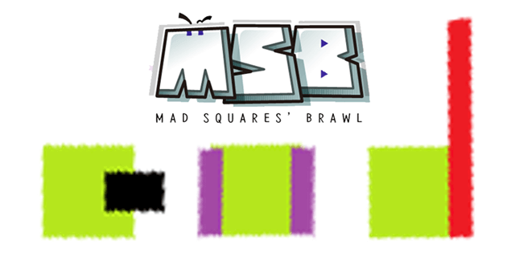

<h1 align="center">
  
   
  
MSB : Mad Square's Brawl

</h1>

    
    
    
    

Mad Square's Brawl is PC game made with Unity

## Screenshots

</img>
</img>

## Team TKQON

### [7kQon](https://github.com/7kQon)

Main Game Designer  

### [LimeCake](https://github.com/LIMECAKE)

Main Game Designer   

## License
[MIT](LICENSE) © 2020 LimeCake <limecake23@gmail.com>